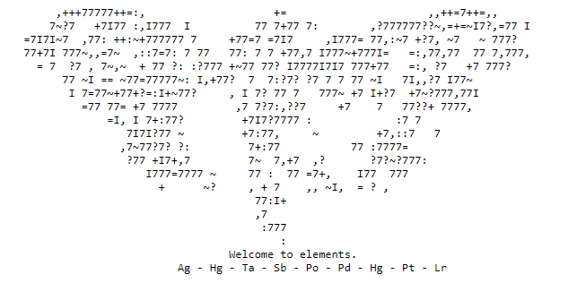

# Nax - Write Up

### Portas

```bash
PORT    STATE SERVICE  VERSION
22/tcp  open  ssh      OpenSSH 7.2p2 Ubuntu 4ubuntu2.8 (Ubuntu Linux; protocol 2.0)
25/tcp  open  smtp     Postfix smtpd 8BITMIME, DSN, 
80/tcp  open  http     Apache httpd 2.4.18 ((Ubuntu))
389/tcp open  ldap     OpenLDAP 2.2.X - 2.3.X
443/tcp open  ssl/http Apache httpd 2.4.18 ((Ubuntu))
```

### Página Web



Na página principal da aplicação encontramos uma de elementos químicos. Pegando seus respectivos números atômicos temos uma sequencia de números que podem ser decodificados de Números ASCII para letras \(só consegui graças ao [CyberChef](https://gchq.github.io/CyberChef/)\).

```bash
Elementos químicos         ->  Números atômicos (ASCII)    ->  Texto
Ag Hg Ta Sb Po Pd Hg Pt Lr ->  47 80 73 51 84 46 80 78 103 ->  /PI3T.PNg
```

### Esteganografia


A imagem inicialmente não faz muito sentido, mas pesquisando pelo nome do arquivo vemos que se trata de uma linguagem de programação conhcida como **Piet**. Através de um [compilador ](https://www.bertnase.de/npiet)podemos interpretar a imagem.

```bash
.\npiet.exe -e 1000 './PI3T.png'
```

### Exploration

Com as credenciais é possível logar no Naxios da máquina e através da CVE-2019-15949 podemos conseguir um RCE.

Para exploração usei o módulo do metasploit

```bash
exploit/linux/http/nagios_xi_authenticated_rce
```

### User Flag

cat /home/galand/user.txt

### Root Flag

cat /root/root.txt

